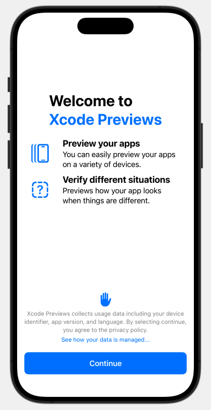
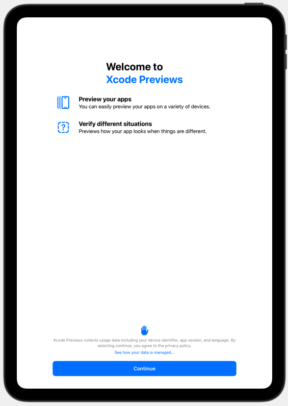
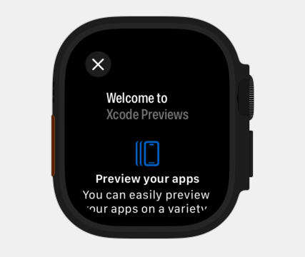

[](https://swiftpackageindex.com/wannafedor4/OnboardingKit)
[](https://swiftpackageindex.com/wannafedor4/OnboardingKit)

# OnboardingKit


be back tommo-i mean today

## I'm back
OnboardingKit is a framework that allows you to display a simple an
consistent onboarding experience that only takes a few lines of code.
It works on iOS, Mac Catalyst, tvOS, and watchOS.



> [!IMPORTANT]
> Since OnboardingKit reads from Info.plist, add the key `CFBundleDisplayName` as your app's name.

To get started, just wrap your code in a GuidedView. You must at least specify a privacy message and URL.
Onboarding expericences are written as the code below

> [!TIP]
> For accessibility reasons, only include up to three features. `GuidedView`
> supports scrolling, but that is only for smaller screens and apps that **<ins>absolutely _NEED_</ins>**
> to display extra features.
```swift
struct MyGuidedApp: App {
    var body: some Scene {
        WindowGroup {
            GuidedView(
                features: [
                    OnboardingFeature(
                        "Preview your apps",
                        systemImage: "iphone.gen3.motion",
                        description: "You can easily preview your apps on a variety of devices."
                    ),
                    OnboardingFeature(
                        "Verify different situations",
                        systemImage: "questionmark.app.dashed",
                        description: "Previews how your app looks when things are different."
                    )
                ],
                privacyDescription: "\(Bundle.main.infoDictionary?["CFBundleDisplayName"] as? String ?? "BUNDLE_NAME") does not use your data in any way throughout usage.",
                privacyURL: URL(string: "https://www.apple.com/privacy")!
            ) {
                Text("Hello, World!")
            }
        }
    }
}
```
